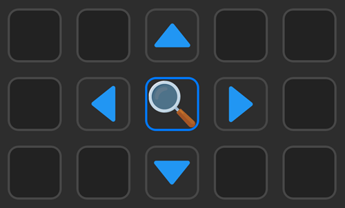

# Magnifier for Stream Deck

## Description
This plugin allows to use a Stream Deck key as a screen magnifier, with up to 32x.

Includes an option to move the mouse pixel by pixel for better precision.

## Details

TODO

## My other Stream Deck plugins

- **[Color Picker](https://github.com/VictorGrycuk/streamdeck-color-picker)**
- **[KeePass for StreamDeck](https://github.com/VictorGrycuk/StreamDeck-KeePass)**

---

**Magnifier** icon by [Dimitry Miroliubov](https://www.flaticon.com/authors/dimitry-miroliubov) and **Mover** icon by [Pixel Perfect](https://www.flaticon.com/authors/pixel-perfect) from [www.flaticon.com](www.flaticon.com), action icon is a modified version of *Material Filled* at [Icon8](https://icons8.com/).

