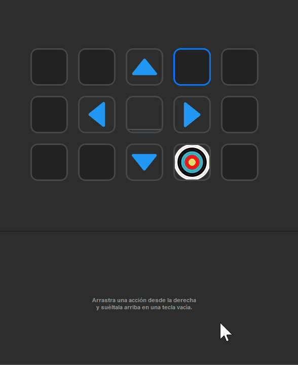
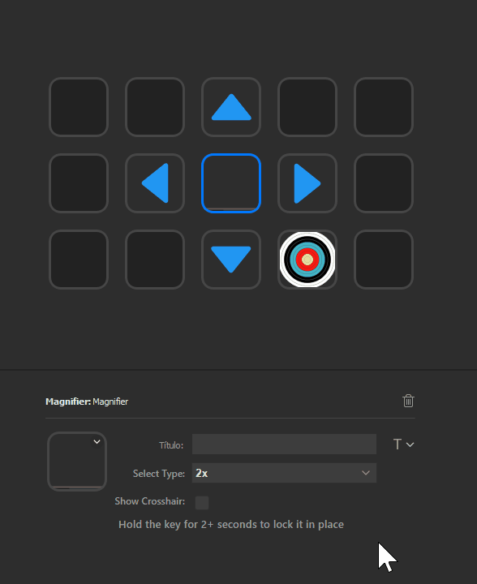

# Magnifier for Stream Deck

## Description
This plugin allows to use a Stream Deck key as a screen magnifier, with up to 32x.

Includes an option to move the mouse pixel by pixel for better precision.

Done using BarRaider's [Stream Deck Tools](https://github.com/BarRaider/streamdeck-tools).

## Features

### Magnifier

- Turns a Stream Deck key into a screen magnifier
- Allows up to 32x zoom
- Press to start, press again to stop
- Long press (+2 seconds) to lock the location, long press again to unlock it
- Refresh update is 10ms
- Optional crosshair

### Mover

- Moves the mouse in the selected direction 1 pixel
- Useful for precision
- Not much to say, its super simple

## My other Stream Deck plugins

- **[Color Picker](https://github.com/VictorGrycuk/streamdeck-color-picker)**
- **[KeePass for StreamDeck](https://github.com/VictorGrycuk/StreamDeck-KeePass)**

---

**Magnifier** icon by [Dimitry Miroliubov](https://www.flaticon.com/authors/dimitry-miroliubov) and **Mover** icon by [Pixel Perfect](https://www.flaticon.com/authors/pixel-perfect) from [www.flaticon.com](www.flaticon.com), action icon is a modified version of *Material Filled* at [Icon8](https://icons8.com/).

